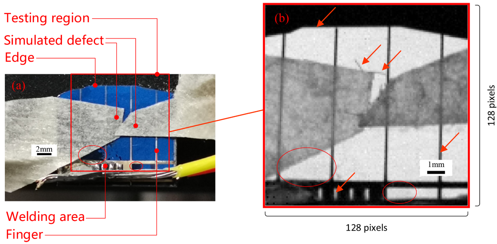
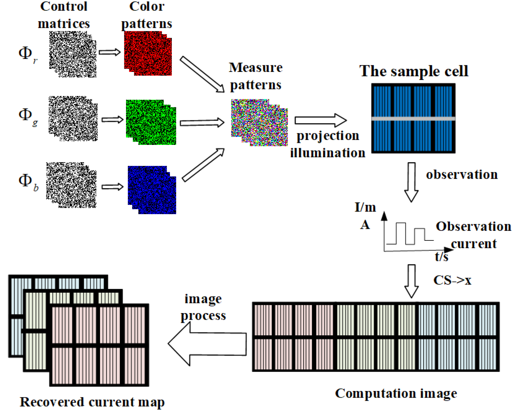
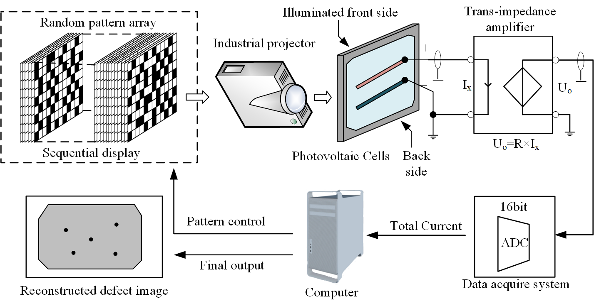

Hi there, wellcome to my homepage!

My name is **Dongwen Gan** (**甘东文**).

I am recently a System Application Engineer at [**STMicroelectronics**](https://www.st.com/) (Shenzhen), since 2023.

I received the Master degree from [**Xidian University**](https://en.wikipedia.org/wiki/Xidian_University), China, in 2023. I spent a wonderful time working closely with Prof. Lei Quan and Prof. Kai Xie at [GATE](https://faculty.xidian.edu.cn/XK3/zh_CN/index.htm) Lab.

Previously, I received the B.E. degree from Xidian University, China, in 2020.

My research interest includes **Deep Learning**, **Compressed Sensing**, **Smart Industrial** and **Wireless Communication**

---

# Scholarships and Honors

* 2019 National Encouragement Scholarship, Department of Education of Shaanxi Province
* 2022 National Scholarship, Ministry of Education of the People's Republic of China.
* 2022 CASC Scholarship, China Aerospace Science and Technology Corporation (CASC).
* 2019 National Undergraduate Electronics Design Contest, Department of Education of Shaanxi Province
* 2021 China Graduate Future Flight Vehicle Innovation Competition.
* 2022 Academic English Communication and Writing Skills Program, Cambridge, Upper Second Class.
* 2024 Top 30 Digital Intelligence Application Award, Guangzhou Electrical Building Technology Committee and Alighting Award Committee

---

# Publications

[1] **Orthogonal modulation based light beam induced current method for anti-noise defect detection in photovoltaic cells**\
**Dongwen Gan**, Lei Quan, Fan Zhu, Kai Xie, and Junmei Bai\
_Solar Energy_, 2022 (IF: 7.188)\
[[Paper]](../files/1-s2.0-S0038092X22006089-main.pdf)

    

​    

[2] **Multispectral compressive light beam induced current method for photovoltaic cell assessment**\
Fan Zhu, Kai Xie, Lei Quan, and **Dongwen Gan**\
_Solar Energy_, 2024 (IF: 6.7)\
[[Paper]](../files/1-s2.0-S0038092X24003165-main.pdf)

    

[3] **Pseudo-random sequence coded electroluminescence imaging for photovoltaic module inspection under outdoor ambient light**\
Fan Zhu, Kai Xie, **Dongwen Gan**, Lei Quan, and Jingyi Zhu\
Submitted to [IEEE Journal of Photovoltaics - IEEE Photonics Society](https://ieeephotonics.org/publications/journal-of-photovoltaics/) [Major revision]

    

[4] **The fast compressed light-beam-induced current method for solar cells detection based on the structural random matrix**\
Fan Zhu, Kai Xie, Lei Quan, **Dongwen Gan**, and Siyu Zhao\
Submitted to [Solar Energy | Journal | ScienceDirect.com by Elsevier](https://www.sciencedirect.com/journal/solar-energy) [Under review]

[5] **Perturbed compressive-based light beam induced current method for anti-noise defect detection in photovoltaic cells**\
Zhikuan Zhao, Lei Quan, **Dongwen Gan**, Siyu Zhao, Ruiyang Zhuang\
Submitted to [Solar Energy | Journal | ScienceDirect.com by Elsevier](https://www.sciencedirect.com/journal/solar-energy) [Under review]

    

[6] **FastPCS: On the Equivalence of Perturbed Compressed Sensing Algorithm**\
**Dongwen Gan**\
[In processing]

[7] **MambaCS: SSM-based architecture for Image Compressed Sensing**\
**Dongwen Gan**\
[In processing]

[8] **一种低频磁性接收天线的设计方法**, CN114122708B, 2022-11-29.

[9] **基于正交调制的光伏电池能效图测量方法**, CN113824400B, 2023-08-22.

[10] **一种实时双内核单机半实物仿真架构及仿真方法**, CN112131741B, 2024-01-30.

---

# Research Interest

My research is primarily centered around those key areas: **Compressed Sensing**, **Deep Learning** and **Smart Industrial**.

## Compressed Sensing

For compressed sensing, my recent interest is to develop perturbed compressed sensing theory, which not only consider the measurement noise but also take the noise of the sensing matrix into account. [Learn more](https://dwgan.top/blog/)

	

## Deep Learning

For deep learning, I am deeply passionate about advancing the capabilities of neural networks through innovative models for vision tasks.

I am currently focused on exploring new models, such as Mamba, to replace traditional Transformer-based architectures. My goal is to achieve more efficient representation and reduced complexity in neural networks. My research particularly targets vision tasks like image compressed sensing, where the objective is to recover higher quality images using fewer samples, requiring enhanced expressive power in neural networks. [Learn more](https://dwgan.top/blog/)

    

## Smart Industrial

For Smart Industrial, I am focusing on develop the ecosystem of smart home/industrial technologies using ST microchips.

As a System Application Engineer at ST, I specialize in smart industrial applications for smart homes, with a primary focus on advancing the ecosystem. One key area of our work is promoting the KNX standard, a leading international protocol in smart home automation that ensures seamless compatibility and plug-and-play functionality across devices. We’ve developed various demos to showcase the integration of ST’s products, such as STM32 MCU/MPU, chips, KNX protocol chips, IO-Link protocol chips, edge AI sensors, DC-DC converters, and energy harvesting chips. Our demos include smart charging stations, mini IoT houses, photovoltaic energy storage and harvesting, IoT sensors, KNX-based smart building management systems, and solutions for remote network monitoring and intranet penetration. [Learn more](https://dwgan.top/blog/)

  

## Intelligent Communication System for Aircraft

For Wireless Communication, I am focusing on develop the communication devices used for wireless data, instruction transmission inside the cabin of rocket.

Since 2020 to 2023, I was participated in some project that provided aerospace devices for Commercial Aerospace Company like [Beijing Skywalk Technology Co., Ltd.](http://www.spacetransportation.com.cn/) During this period, I was able to design high-reliable hardware and software for aerospace devices as well as solve some problem using wireless communication. I learned how to solve those hard problems in aerospace devices using a systems engineering mindset.

Aim to empowering the next generation of intelligent aircraft communication systems, we addresses challenges in the application of new technologies, leveraging existing industrial technologies for low-cost, rapid iteration of aircraft devices. My primary focus is on in-cabin wireless communication, wireless power transfer, and onboard central computer for rocket.

Utilizing ultra wide band (UWB) wireless communication technology, we solve some wireless communication challenges including high-rate transmission (camera data), time-sensitive transmission (synchronous data), high-reliable transmission (instruction data) and wireless networking (hard to realize by wire communication). We also solve problem of wireless power and proposed unified core communication framework for missile-borne computer.

All devices are verified through aerospace experiment and flight missions.

  

---

Skills
======

* Deep Learning
* High Reliable Embedded System Development and Circuit Design
* Programming Language: Python, C, MATLAB, Verilog
* OS: Windows, Linux, RTOS
