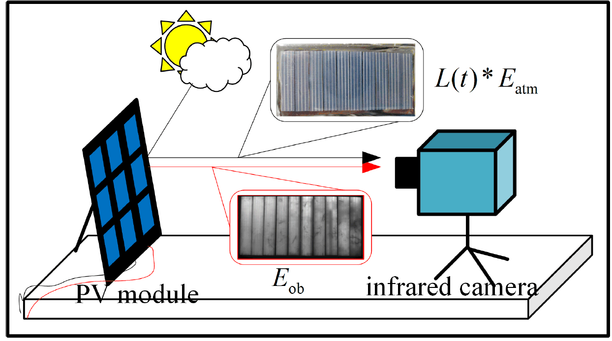

Hi there, wellcome to my homepage!

I am recently an Application Engineer at **STMicroelectronics** (Shenzhen).

I received the Master degree from **Xidian University**, China. I spent a wonderful time working closely with Prof. [Lei Quan](https://web.xidian.edu.cn/quanlei/) and Prof. [Kai Xie](https://faculty.xidian.edu.cn/XK3/zh_CN/index.htm) at [GATE](https://faculty.xidian.edu.cn/XK3/zh_CN/index.htm) Lab.

Previously, I received the B.E. degree from Xidian University, China. 

My research interest includes **Deep Learning**, **Compressed Sensing**, **Wireless Communication**，**Internet of Things**, and **Embedded Development**

## Scholarships and Honors 

* 2019 National Encouragement Scholarship, Department of Education of Shaanxi Province
* 2022 National Scholarship, Ministry of Education of the People's Republic of China.
* 2022 CASC Scholarship, China Aerospace Science and Technology Corporation (CASC).
* 2019 National Undergraduate Electronics Design Contest, Department of Education of Shaanxi Province
* 2021 China Graduate Future Flight Vehicle Innovation Competition.
* 2022 Academic English Communication and Writing Skills Program, Cambridge, Upper Second Class.
* 2024 Top 30 Digital Intelligence Application Award, Guangzhou Electrical Building Technology Committee and Alighting Award Committee

## Publications

[1] **Orthogonal modulation based light beam induced current method for anti-noise defect detection in photovoltaic cells**\

**Dongwen Gan**, Lei Quan, Fan Zhu, Kai Xie, and Junmei Bai\
_Solar Energy_, 2022 (IF: 7.188)\
[[Paper]](../paper/1-s2.0-S0038092X22006089-main.pdf)

[2] **Multispectral compressive light beam induced current method for photovoltaic cell assessment**\

Fan Zhu, Kai Xie, Lei Quan, and Dongwen Gan\
_Solar Energy_, 2024 (IF: 6.7)\
[[Paper]](../paper/1-s2.0-S0038092X24003165-main.pdf)

[3] **Pseudo-random sequence coded electroluminescence imaging for photovoltaic module inspection under outdoor ambient light**\

Fan Zhu, Kai Xie, **Dongwen Gan**, Lei Quan, and Jingyi Zhu\
Submitted to [IEEE Journal of Photovoltaics - IEEE Photonics Society](https://ieeephotonics.org/publications/journal-of-photovoltaics/)

[4] **The fast compressed light-beam-induced current method for solar cells detection based on the structural random matrix**\
Fan Zhu, Kai Xie, Lei Quan, **Dongwen Gan**, and Siyu Zhao\
Submitted to [Solar Energy | Journal | ScienceDirect.com by Elsevier](https://www.sciencedirect.com/journal/solar-energy)

[5] **Perturbed compressed sensing-based light beam induced current method for robust defect detection in photovoltaic cells**\

In processing

[1] **一种低频磁性接收天线的设计方法**, CN114122708B, 2022-11-29.

[2] **基于正交调制的光伏电池能效图测量方法**, CN113824400B, 2023-08-22.

[3] **一种实时双内核单机半实物仿真架构及仿真方法**, CN112131741B, 2024-01-30.

Skills
------

* High Reliable Embedded System Development and Circuit Design
* Programming: Python (Pytorch), C, MATLAB, Verilog, Shell
* OS: Windows, Linux, RTOS

